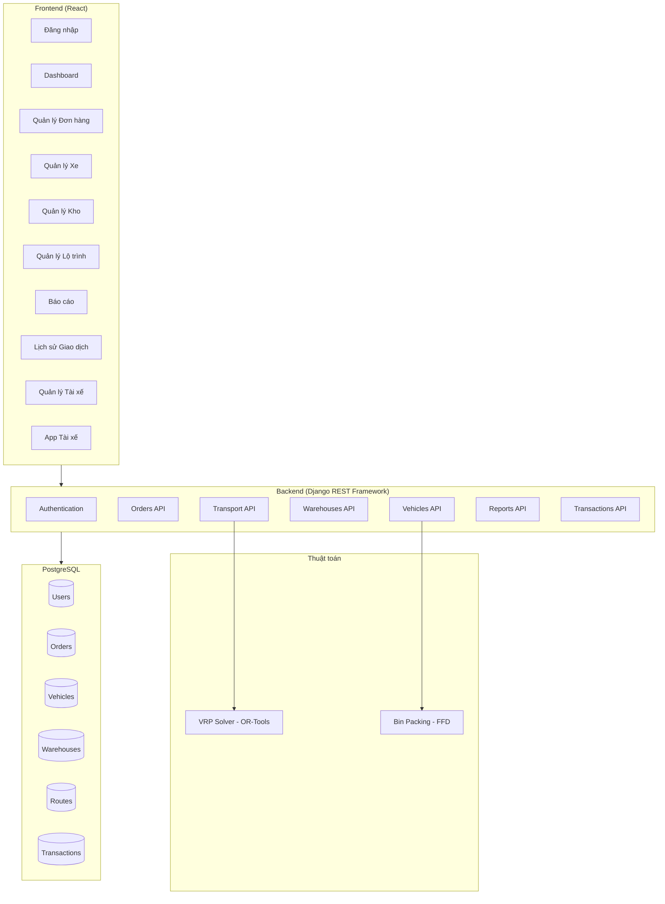

# Mô Tả Hệ Thống VRP Logistics

## 📋 Tổng Quan

**VRP Logistics** là một hệ thống quản lý logistics và vận chuyển toàn diện, được thiết kế để tối ưu hóa việc giao hàng sử dụng thuật toán VRP (Vehicle Routing Problem) với Google OR-Tools.

---

## 🏗️ Kiến Trúc Hệ Thống



---

## 👥 Phân Quyền Người Dùng

| Role | Mô tả | Quyền hạn |
|------|-------|-----------|
| **Admin** | Quản trị viên hệ thống | Toàn quyền: CRUD tất cả entities, xác nhận giao dịch, xem báo cáo |
| **Manager** | Quản lý điều phối | Quản lý đơn hàng, lộ trình, xem báo cáo |
| **Dispatcher** | Người điều phối | Tạo lộ trình, phân đơn cho xe |
| **Driver** | Tài xế | Xem đơn được phân, xác nhận giao hàng, upload ảnh minh chứng |

---

## 📦 Module Chi Tiết

### 1. Authentication (Xác thực)

#### Chức năng:
- **Đăng nhập**: Sử dụng JWT (JSON Web Token)
- **Đăng ký tài khoản**: Tạo user mới với role
- **Quản lý profile**: Xem/cập nhật thông tin cá nhân
- **Đăng xuất**: Invalidate token

#### API Endpoints:
| Method | Endpoint | Mô tả |
|--------|----------|-------|
| POST | `/api/auth/login/` | Đăng nhập |
| POST | `/api/auth/register/` | Đăng ký |
| GET | `/api/auth/profile/` | Xem profile |
| PUT | `/api/auth/profile/` | Cập nhật profile |
| POST | `/api/auth/logout/` | Đăng xuất |
| GET | `/api/auth/users/` | Danh sách users (Admin) |
| GET | `/api/auth/drivers/` | Danh sách tài xế |

---

### 2. Orders (Quản lý Đơn hàng)

#### Chức năng:
- **CRUD đơn hàng**: Tạo, xem, sửa, xóa đơn hàng
- **Import hàng loạt**: Bulk import từ Excel (XLSX)
- **Quản lý trạng thái**: Cập nhật trạng thái đơn hàng
- **Phân đơn**: Gán đơn cho xe và tài xế
- **Xóa theo lô**: Xóa tất cả đơn pending (giữ lại đơn đã giao)

#### Trạng thái đơn hàng:
```
pending → confirmed → assigned → picked_up → in_transit → delivered
                                                       ↘ failed
                                                       ↘ cancelled
```

| Trạng thái | Mô tả |
|------------|-------|
| `pending` | Đơn mới tạo, chờ xử lý |
| `confirmed` | Đã xác nhận |
| `assigned` | Đã phân cho xe/tài xế |
| `picked_up` | Đã lấy hàng từ kho |
| `in_transit` | Đang vận chuyển |
| `delivered` | Đã giao thành công |
| `failed` | Giao thất bại |
| `cancelled` | Đã hủy |

#### Dữ liệu đơn hàng:
- `order_code`: Mã đơn hàng (duy nhất)
- `customer_name`, `customer_phone`: Thông tin khách
- `delivery_address`, `delivery_lat`, `delivery_lng`: Địa chỉ giao (có tọa độ)
- `amount`: Giá trị COD
- `weight`, `volume`: Khối lượng (kg), thể tích (m³)
- `warehouse_id`: Kho chứa hàng
- `shelf_position`: Vị trí kệ trong kho (Format: SHELF-ROW-COL-LEVEL)
- `proof_image`: Ảnh minh chứng giao hàng (Base64)
- `admin_confirmed`: Đánh dấu admin đã xác nhận

#### API Endpoints:
| Method | Endpoint | Mô tả |
|--------|----------|-------|
| GET/POST | `/api/orders/` | Danh sách / Tạo đơn |
| GET/PUT/DELETE | `/api/orders/{id}/` | Chi tiết / Cập nhật / Xóa |
| POST | `/api/orders/bulk/` | Import hàng loạt |
| GET | `/api/orders/pending/` | Đơn chờ xử lý |
| PUT | `/api/orders/{id}/status/` | Cập nhật trạng thái |
| PUT | `/api/orders/{id}/assign/` | Phân đơn cho xe |
| DELETE | `/api/orders/delete-all/` | Xóa tất cả pending |
| GET | `/api/orders/warehouse/{id}/stats/` | Thống kê kệ trong kho |
| GET | `/api/orders/warehouse/{id}/capacity/` | Sức chứa còn lại |

---

### 3. Vehicles (Quản lý Phương tiện)

#### Chức năng:
- **CRUD xe**: Quản lý đội xe
- **Theo dõi vị trí**: Cập nhật GPS realtime
- **Bin Packing**: Xếp đơn vào xe tối ưu (thuật toán FFD)

#### Loại xe:
| Type | Mô tả |
|------|-------|
| `truck` | Xe tải |
| `van` | Xe van |
| `motorcycle` | Xe máy |

#### Trạng thái xe:
| Status | Mô tả |
|--------|-------|
| `available` | Sẵn sàng |
| `busy` | Đang chạy route |
| `maintenance` | Đang bảo trì |
| `inactive` | Không hoạt động |

#### Dữ liệu xe:
- `plate_number`: Biển số xe
- `vehicle_type`: Loại xe
- `capacity_kg`: Tải trọng (kg)
- `capacity_volume`: Thể tích tải (m³)
- `driver_id`: Tài xế phụ trách
- `cost_per_km`: Chi phí/km
- `current_lat`, `current_lng`: Vị trí hiện tại

#### Bin Packing Algorithm (First Fit Decreasing):
```
Input: Danh sách đơn hàng + Danh sách xe
Output: Phân bổ đơn vào xe tối ưu theo weight/volume
```

#### API Endpoints:
| Method | Endpoint | Mô tả |
|--------|----------|-------|
| GET/POST | `/api/vehicles/` | Danh sách / Tạo xe |
| GET/PUT/DELETE | `/api/vehicles/{id}/` | Chi tiết / Cập nhật / Xóa |
| GET | `/api/vehicles/available/` | Xe sẵn sàng |
| PUT | `/api/vehicles/{id}/location/` | Cập nhật GPS |
| POST | `/api/vehicles/pack/` | Bin Packing algorithm |

---

### 4. Warehouses (Quản lý Kho)

#### Chức năng:
- **CRUD kho**: Quản lý hệ thống kho
- **Theo dõi sức chứa**: Thể tích đã dùng / tổng
- **Tọa độ kho**: Phục vụ tính toán lộ trình

#### Loại kho:
| Type | Mô tả |
|------|-------|
| `main` | Kho chính |
| `sub` | Kho phụ |
| `transit` | Điểm trung chuyển |

#### Dữ liệu kho:
- `code`, `name`: Mã và tên kho
- `address`: Địa chỉ
- `lat`, `lng`: Tọa độ GPS
- `total_volume`: Tổng sức chứa (m³)
- `used_volume`: Đã sử dụng (m³)

#### API Endpoints:
| Method | Endpoint | Mô tả |
|--------|----------|-------|
| GET/POST | `/api/warehouses/` | Danh sách / Tạo kho |
| GET/PUT/DELETE | `/api/warehouses/{id}/` | Chi tiết / Cập nhật / Xóa |

---

### 5. Transport - Routes (Quản lý Lộ trình)

#### Chức năng:
- **CRUD lộ trình**: Tạo và quản lý routes
- **VRP Optimization**: Tối ưu lộ trình bằng Google OR-Tools
- **Theo dõi tiến độ**: Trạng thái route và từng điểm dừng
- **Điều khiển route**: Start/Complete routes

#### VRP Solver (Capacitated Vehicle Routing Problem):
```
Input:
  - depot_location: Tọa độ kho (điểm xuất phát)
  - order_locations: Danh sách tọa độ đơn hàng
  - vehicle_capacities: Sức chứa từng xe
  - order_demands: Yêu cầu tải của từng đơn

Output:
  - routes: Lộ trình tối ưu cho từng xe
  - total_distance_km: Tổng quãng đường
  - num_vehicles_used: Số xe sử dụng

Algorithm:
  - First Solution: PATH_CHEAPEST_ARC
  - Metaheuristic: GUIDED_LOCAL_SEARCH
  - Time Limit: 10 seconds
  - Distance: Haversine formula (km)
```

#### Trạng thái Route:
| Status | Mô tả |
|--------|-------|
| `pending` | Chờ bắt đầu |
| `in_progress` | Đang thực hiện |
| `completed` | Hoàn thành |
| `cancelled` | Đã hủy |

#### Trạng thái RouteStop:
| Status | Mô tả |
|--------|-------|
| `pending` | Chưa đến |
| `arrived` | Đã đến |
| `completed` | Hoàn thành |
| `skipped` | Bỏ qua |

#### Dữ liệu Route:
- `code`: Mã lộ trình
- `vehicle_id`, `driver_id`: Xe và tài xế thực hiện
- `warehouse_id`: Kho xuất phát
- `total_distance`, `total_time`: Quãng đường (km), thời gian (phút)
- `total_orders`, `total_weight`: Tổng đơn, tổng tải

#### Dữ liệu RouteStop:
- `sequence`: Thứ tự điểm dừng
- `order_id`: Đơn hàng tại điểm này
- `stop_type`: pickup / delivery / warehouse
- `latitude`, `longitude`, `address`: Vị trí
- `distance_from_previous`, `time_from_previous`: Khoảng cách/thời gian từ điểm trước

#### API Endpoints:
| Method | Endpoint | Mô tả |
|--------|----------|-------|
| GET/POST | `/api/transport/routes/` | Danh sách / Tạo route |
| GET/PUT/DELETE | `/api/transport/routes/{id}/` | Chi tiết / Cập nhật / Xóa |
| POST | `/api/transport/routes/{id}/start/` | Bắt đầu route |
| POST | `/api/transport/routes/{id}/complete/` | Hoàn thành route |
| POST | `/api/transport/optimize/` | **VRP Optimization** |
| PUT | `/api/transport/routes/{route_id}/stops/{stop_id}/` | Cập nhật điểm dừng |

---

### 6. Reports (Báo cáo & Thống kê)

#### Chức năng:
- **Dashboard tổng quan**: Số liệu realtime
- **Báo cáo đơn hàng**: Theo trạng thái, theo ngày
- **Báo cáo xe**: Theo loại, theo trạng thái
- **Báo cáo lộ trình**: Quãng đường, thời gian
- **Hiệu suất**: Tỷ lệ giao thành công, sử dụng xe

#### Dashboard Metrics:
```
Orders:
  - total, pending, in_transit, completed
  - today, delivered_today

Vehicles:
  - total, available, busy

Warehouses:
  - total, active

Routes:
  - total, active, completed
```

#### API Endpoints:
| Method | Endpoint | Mô tả |
|--------|----------|-------|
| GET | `/api/reports/dashboard/` | Thống kê tổng quan |
| GET | `/api/reports/orders/` | Báo cáo đơn hàng |
| GET | `/api/reports/vehicles/` | Báo cáo xe |
| GET | `/api/reports/routes/` | Báo cáo lộ trình |
| GET | `/api/reports/performance/` | Báo cáo hiệu suất |

---

### 7. Transactions (Lịch sử Giao dịch)

#### Chức năng:
- **Ghi nhận giao dịch**: Khi tài xế hoàn thành đơn
- **Xác nhận Admin**: Workflow duyệt giao hàng
- **Upload ảnh minh chứng**: Base64 hoặc URL
- **Xử lý thất bại**: Cộng lại thể tích kho

#### Trạng thái Transaction:
| Status | Mô tả |
|--------|-------|
| `pending` | Chờ Admin xác nhận |
| `confirmed` | Đã xác nhận thành công |
| `rejected` | Bị từ chối |
| `failed_pending` | Báo thất bại, chờ xác nhận |
| `failed_confirmed` | Đã xác nhận thất bại |

#### Workflow:
```
Tài xế giao hàng → Tạo Transaction (pending) → Admin xác nhận → confirmed
                                                            ↘ rejected

Tài xế báo thất bại → Transaction (failed_pending) → Admin xác nhận → failed_confirmed
                                                                    → (Cộng volume về kho)
```

#### API Endpoints:
| Method | Endpoint | Mô tả |
|--------|----------|-------|
| GET/POST | `/api/transactions/` | Danh sách / Tạo transaction |
| GET/PUT | `/api/transactions/{id}/` | Chi tiết / Cập nhật |
| PUT | `/api/transactions/{id}/confirm/` | Admin xác nhận |
| GET | `/api/transactions/pending/` | Danh sách chờ duyệt |

---

### 8. Driver Interface (Giao diện Tài xế)

#### Chức năng:
- **Xem route hiện tại**: Danh sách điểm giao
- **Xem tất cả đơn được phân**: Lịch sử đơn
- **Xác nhận giao hàng**: Upload ảnh minh chứng
- **Báo giao thất bại**: Tạo transaction chờ duyệt
- **Điều hướng**: Tích hợp bản đồ

#### API Endpoints (Driver-specific):
| Method | Endpoint | Mô tả |
|--------|----------|-------|
| GET | `/api/driver/current-order/` | Route hiện tại + stops |
| GET | `/api/driver/orders/` | Tất cả đơn của driver |
| POST | `/api/driver/confirm-delivery/` | Xác nhận giao hàng |
| POST | `/api/driver/mark-failed/` | Báo giao thất bại |

---

## 🖥️ Frontend Pages

| Trang | Mô tả | Role |
|-------|-------|------|
| `/login` | Đăng nhập | All |
| `/dashboard` | Tổng quan, thống kê | Admin, Manager |
| `/orders` | Quản lý đơn hàng | Admin, Manager, Dispatcher |
| `/vehicles` | Quản lý xe | Admin, Manager |
| `/warehouses` | Quản lý kho | Admin, Manager |
| `/routes` | Quản lý lộ trình, VRP | Admin, Manager, Dispatcher |
| `/reports` | Báo cáo, biểu đồ | Admin, Manager |
| `/transactions` | Lịch sử, xác nhận | Admin |
| `/drivers` | Quản lý tài xế | Admin, Manager |
| `/driver` | Giao diện tài xế | Driver |

---

## 🔧 Tech Stack

### Backend:
- **Framework**: Django 4.x + Django REST Framework
- **Database**: PostgreSQL
- **Authentication**: JWT (djangorestframework-simplejwt)
- **VRP Solver**: Google OR-Tools
- **File Handling**: openpyxl (Excel import)

### Frontend:
- **Framework**: React 18
- **HTTP Client**: Axios
- **Charts**: Chart.js / Recharts
- **Maps**: Leaflet / Google Maps
- **Styling**: CSS (vanilla)

---

## 📊 Thuật toán Tối ưu

### 1. VRP - Vehicle Routing Problem
- **Library**: Google OR-Tools
- **Variant**: CVRP (Capacitated VRP)
- **Distance**: Haversine formula
- **Strategy**: PATH_CHEAPEST_ARC + GUIDED_LOCAL_SEARCH
- **Output**: Routes tối ưu cho fleet xe

### 2. Bin Packing
- **Algorithm**: First Fit Decreasing (FFD)
- **Input**: Orders (weight/volume) + Vehicles (capacity)
- **Output**: Phân bổ đơn vào xe tối ưu

---

## 📁 Cấu trúc Thư mục

```
vrp_logistics/
├── backend/
│   ├── authentication/     # User management, JWT
│   ├── orders/            # Order CRUD, bulk import
│   ├── vehicles/          # Vehicle CRUD, bin packing
│   ├── warehouses/        # Warehouse CRUD
│   ├── transport/         # Routes, VRP solver
│   ├── reports/           # Statistics, dashboards
│   ├── transactions/      # Delivery confirmation
│   └── vrp_project/       # Django settings
├── frontend/
│   └── src/
│       ├── components/    # Reusable components
│       ├── pages/         # Page components
│       ├── services/      # API services
│       └── context/       # React context
└── *.xlsx                 # Sample import files
```

---

## 🔄 Workflow Chính

### 1. Nhập đơn hàng
```
Import Excel → Validate → Gán Warehouse → Tính tọa độ → Lưu DB → Cập nhật used_volume kho
```

### 2. Tối ưu lộ trình
```
Chọn Warehouse + Orders + Vehicles → VRP Solver → Tạo Routes + RouteStops → Gán Driver
```

### 3. Giao hàng
```
Driver nhận route → Bắt đầu → Giao từng điểm → Upload ảnh → Admin xác nhận → Hoàn thành
```

### 4. Xử lý thất bại
```
Driver báo thất bại → Transaction pending → Admin xác nhận → Cộng volume về kho
```
